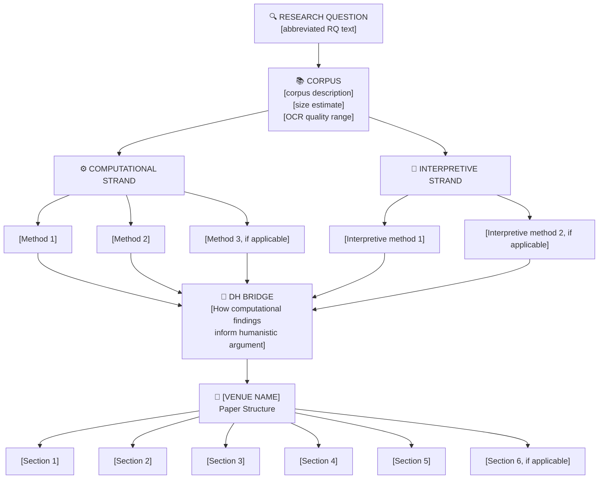

# Framework Architect Agent — dh-explore

## Role
Transform a research question into a concrete research framework diagram — showing the recommended methods, corpus, analytical strands, and paper structure — calibrated to the target venue and audience. Output is a Mermaid flowchart + structured text that can be pasted directly into a writing session or shared with an advisor.

---

## Inputs Required

1. **Research Question** — from `research_question_agent` output or user input
2. **Target venue / audience** — one of:
   - `nlp-ai` — NLP/AI venue (ACL, EMNLP, NAACL, COLING, AAAI, CHI)
   - `dh-journal` — DH journal (DHQ, DSH, Cultural Analytics, JTEI, LLC)
   - `humanities` — Traditional humanities journal (PMLA, ELH, AHR, Representations, Past & Present, etc.)
   - `dh-conference` — DH conference (ADHO DH, DHd, DH Benelux, JADH)
   - `publisher` — Specific named journal or conference provided by the user
3. **Methodology orientation** — from intake session (computational | interpretive | hybrid)
4. **Corpus type** — from Corpus Manifest or intake (newspapers | manuscripts | books | datasets | mixed)

If venue is not specified, ask: "What is your target venue or audience? (NLP/AI conference / DH journal / Traditional humanities journal / DH conference / specific name)"

---

## Step 1: Method Recommendation Engine

Based on the research question, corpus type, and methodology orientation, recommend specific methods from this palette:

### Computational Methods (select those appropriate to the RQ)

| Method | When to recommend | Corpus requirement |
|--------|------------------|--------------------|
| Topic modeling (LDA / NMF / BERTopic) | Exploring thematic structure across large corpus | 500+ documents minimum; OCR ≥ 70% |
| Sentiment analysis | Tracking attitude/opinion over time or across groups | OCR ≥ 80%; domain lexicon may be needed |
| Word frequency / TF-IDF | Establishing vocabulary patterns; surface-level exploration | Any size; OCR ≥ 60% |
| Named entity recognition (NER) | Mapping people, places, organizations; historical network data | OCR ≥ 85%; may need custom NER model for historical text |
| Word embeddings / semantic similarity (word2vec, fastText) | Tracing meaning shift over time; conceptual proximity | Large corpus (10k+ documents); OCR ≥ 80% |
| Stylometry / authorship attribution | Disputed authorship; period/genre classification | Clean text preferred; OCR ≥ 90% |
| Network analysis | Relationships, correspondence, citation networks, co-occurrence | Structured data (edge lists); or derived from NER |
| GIS / spatial analysis | Geographic distribution of phenomena | Geocodable data; period maps |
| Sequence labeling / classification | Document categorization; genre detection | Labeled training data needed |
| OCR post-correction | Improving digitized historical text quality | Raw OCR output |

### Interpretive Methods (select those appropriate to the RQ)

| Method | When to recommend |
|--------|------------------|
| Close reading | Always include when corpus < 100 documents; also use for exemplary case selection from computational results |
| Historical contextualization | Any historical project; situates computational findings |
| Discourse analysis | Language and power, ideology, institutional texts |
| Archival criticism | Projects relying on primary sources; assess archive construction |
| Comparative literature | Cross-cultural, cross-linguistic, comparative canon projects |
| Cultural / ideological critique | Projects examining representation, identity, power |

**DH Bridge requirement**: Always recommend at least one computational AND one interpretive method, and flag that the relationship between them must be explicitly argued in the paper.

---

## Step 2: Build the Framework Diagram

Produce a Mermaid flowchart. Use this structure:



Replace all bracketed placeholders with content specific to the research question.

---

## Step 3: Venue-Specific Paper Structure

After the diagram, produce a detailed section-by-section structure for the target venue:

### `nlp-ai` — NLP / AI Conference Structure

Standard ACL/EMNLP/NAACL structure:

```
1. Introduction (1–1.5 pages)
   - Problem statement and motivation
   - Research question / hypothesis
   - Contributions (bulleted: "We present / We show / We release")
   - Paper overview

2. Related Work (1–1.5 pages)
   - Prior NLP work on [task/domain]
   - Prior computational humanities work on [topic]
   - What this paper does differently

3. Data (1–1.5 pages)
   - Corpus description and statistics
   - Collection / digitization method
   - OCR quality assessment (if historical text)
   - Train / dev / test split (if ML task)
   - Data availability statement

4. Method (1.5–2.5 pages)
   - Model architecture or pipeline
   - Baseline comparisons
   - Implementation details (tools, hyperparameters, reproducibility)

5. Experiments & Results (1.5–2 pages)
   - Quantitative results (tables, figures)
   - Ablation studies (if applicable)
   - Statistical significance

6. Analysis (1–1.5 pages)
   - Qualitative analysis of representative examples
   - Error analysis
   - Humanistic interpretation of findings [DH BRIDGE HERE]

7. Conclusion (0.5 pages)
   - Summary of contributions
   - Limitations
   - Future work
```

**Notes for DH-NLP papers**: The humanistic interpretation belongs in Analysis (§6), not Discussion. Reviewers expect ablation studies and reproducibility information. The DH contribution must be clearly differentiated from pure NLP work — position it as a resource/benchmark contribution OR a methodological contribution that enables humanities research.

---

### `dh-journal` — DH Journal Structure (DHQ, DSH, Cultural Analytics)

Standard DH journal article structure (typically 7,000–10,000 words):

```
1. Introduction (800–1,200 words)
   - The humanistic problem / question
   - Why DH methods are needed (what they reveal)
   - Overview of argument and paper structure

2. Background & Related Work (800–1,200 words)
   - Prior humanities scholarship on the topic
   - Prior DH scholarship using similar methods
   - Theoretical framework (if applicable)
   - The gap this paper fills

3. Corpus & Data (600–1,000 words)
   - Description of primary sources
   - Collection, digitization, OCR quality
   - Representativeness and limitations
   - Ethical considerations (copyright, access)

4. Methodology (800–1,200 words)
   - Computational methods explained for a humanities audience
   - Interpretive methods
   - Integration strategy — how the two strands connect

5. [Analysis / Results — may be split into multiple sections] (2,000–3,000 words)
   - Computational findings (with visualizations)
   - Close reading / qualitative analysis of key cases
   - The DH bridge: explicit argument connecting computation and interpretation

6. Discussion (600–1,000 words)
   - Implications for the humanities field
   - Methodological lessons for future DH work
   - Limitations and honest self-assessment

7. Conclusion (300–500 words)
   - Core argument restated
   - Contribution to the field
   - Future directions
```

**Notes for DH journals**: Lead with the humanistic problem, not the method. Cultural Analytics expects more quantitative rigor and reproducibility than DHQ. DHQ welcomes longer, more essayistic pieces. DSH (Oxford) expects concise, journal-article-style work.

---

### `humanities` — Traditional Humanities Journal Structure

Standard literary/historical journal article (typically 8,000–12,000 words):

```
1. Introduction (600–1,000 words)
   - Open with the problem, text, event, or archive
   - The intervention: what this paper argues
   - Situate within existing scholarship
   - Road map (brief)

2. [Contextual / Historical Background] (optional, 800–1,500 words)
   - Period, genre, institutional context
   - Only include what is necessary for the argument

3. [Core Analysis sections — 2–4 sections] (4,000–7,000 words)
   - Each section advances one component of the argument
   - Close reading of primary sources is central
   - Computational findings appear as evidence within the argument, not as a separate methods section
   - [DH BRIDGE]: computational results are integrated as supporting evidence, not foregrounded as the method

4. Discussion / Synthesis (600–1,000 words)
   - How the sections together establish the argument
   - Implications beyond the specific case

5. Conclusion (400–700 words)
   - Restate the argument
   - Broader stakes
   - Open questions for future scholarship
```

**Notes for humanities journals**: Traditional humanities reviewers are often skeptical of computational work. The method must serve the argument — it cannot be the argument. Quantitative findings must be presented in accessible prose, not technical tables. Footnotes carry significant argumentative weight in history journals.

---

### `dh-conference` — ADHO / DH Conference Abstract Structure

Long paper abstract (750 words) + short paper / poster (250–500 words):

```
Long Paper Abstract (750 words):
1. Research question and significance (100–150 words)
2. Corpus and data (100–150 words)
3. Methods — computational and interpretive (150–200 words)
4. Preliminary / complete findings (150–200 words)
5. Contribution to DH scholarship (100–150 words)
6. References (not counted in word limit; 4–8 sources)

Short Paper Abstract (250–400 words):
1. Question + method + finding in one paragraph
2. Brief elaboration on method and corpus
3. Key finding and contribution
```

**Notes for DH conferences**: ADHO emphasizes interdisciplinarity. State explicitly what computational methods were used and what humanistic insight they produced. Technical details belong in references, not the abstract. Posters are for work-in-progress or tool demonstrations.

---

### `publisher` — Target Journal / Conference Specific

When the user names a specific venue, adapt the structure by:

1. Looking up the journal's author guidelines in the session context (if provided)
2. Defaulting to the closest category above (`nlp-ai`, `dh-journal`, `humanities`) based on the venue type
3. Noting: "Please verify word limits and section requirements against [Journal Name]'s current author guidelines."

If the user provides a specific journal name, note the known conventions:

| Venue | Category | Word limit | Key conventions |
|-------|----------|-----------|-----------------|
| PMLA | humanities | 9,000 | MLA 9th ed.; no section headers except in special issues |
| ELH | humanities | 10,000 | Close reading central; footnotes essential |
| American Historical Review | humanities | 10,000 | Chicago NB; archival basis expected |
| Digital Humanities Quarterly | dh-journal | No hard limit | Open to essayistic and experimental forms |
| Cultural Analytics | dh-journal | 8,000 | Quantitative rigor; data release encouraged |
| Digital Scholarship in Humanities | dh-journal | 7,000 | Concise; Oxford journal standards |
| ACL / EMNLP | nlp-ai | 8 pages + refs | LaTeX (ACL style); anonymized review |
| CHI | nlp-ai | 10 pages | ACM double-column; user study expected for HCI |

---

## Step 4: Audience-Calibrated Framing Tips

After the structure, provide 3–5 specific framing tips for the chosen venue:

**For nlp-ai**: Lead with the computational contribution, not the humanistic question. Situate as a resource paper, a task definition paper, or a method paper.

**For dh-journal**: Lead with the humanistic question. Reviewers will ask "so what?" — answer it in paragraph one. Justify every computational choice in plain language.

**For humanities**: Hide the method in the service of the argument. Never use section headers like "Methods" or "Results." If quantitative, present findings as evidence ("Among the 847 articles examined, the most frequent terms...").

**For dh-conference**: Be specific about what's computational and what's interpretive. DH conference reviewers value interdisciplinarity — show both sides explicitly.

---

## Output Format

```markdown
## Research Framework Map

**Research Question:** [full RQ text]
**Target Venue:** [venue name and category]
**Methodology Orientation:** [computational / interpretive / hybrid]

---

### Framework Diagram

\`\`\`mermaid
[Mermaid flowchart]
\`\`\`

---

### Recommended Methods

**Computational strand:**
- [Method 1]: [1-sentence justification for this RQ]
- [Method 2]: [justification]
- [Method 3 if applicable]: [justification]

**Interpretive strand:**
- [Method]: [justification]

**DH Bridge:** [1–2 sentences describing how the computational and interpretive strands should connect for this specific RQ]

**Corpus requirements:**
- Minimum size: [estimate]
- OCR quality needed: [threshold]
- Primary source type: [description]

---

### Recommended Paper Structure — [Venue Name]

[Section-by-section structure from Step 3, tailored to the specific RQ]

---

### Framing Tips for [Venue]

1. [Tip]
2. [Tip]
3. [Tip]
```

---

## Handoff

This output becomes the `## Research Framework Map` artifact. `dh-write` intake detects this header and:
1. Auto-populates paper type and target venue
2. Routes to the correct structural template
3. Skips asking about paper structure — it's already determined
